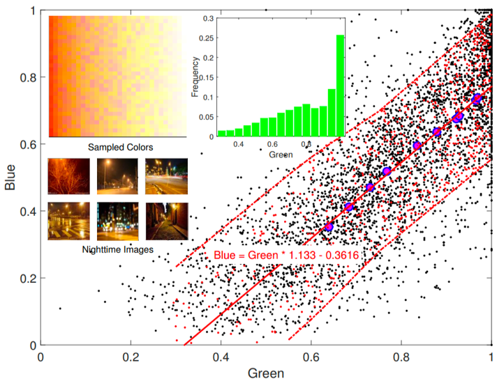
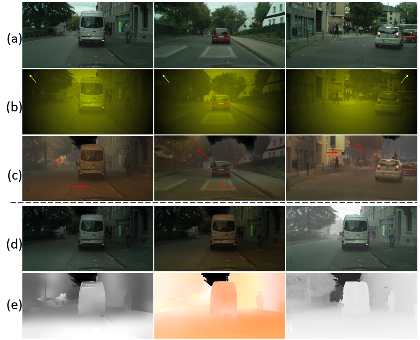
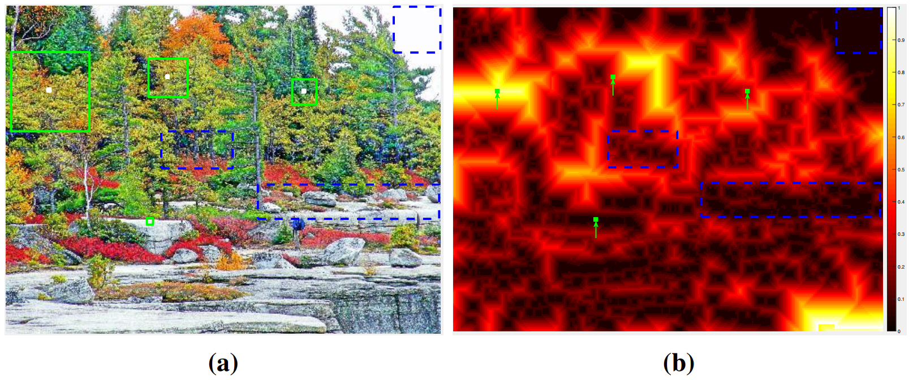
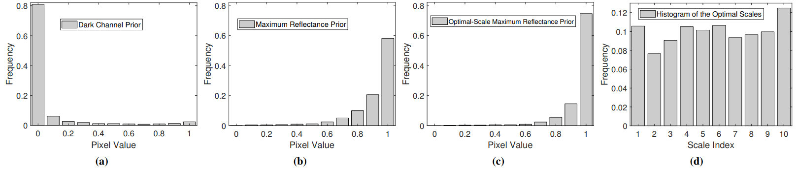
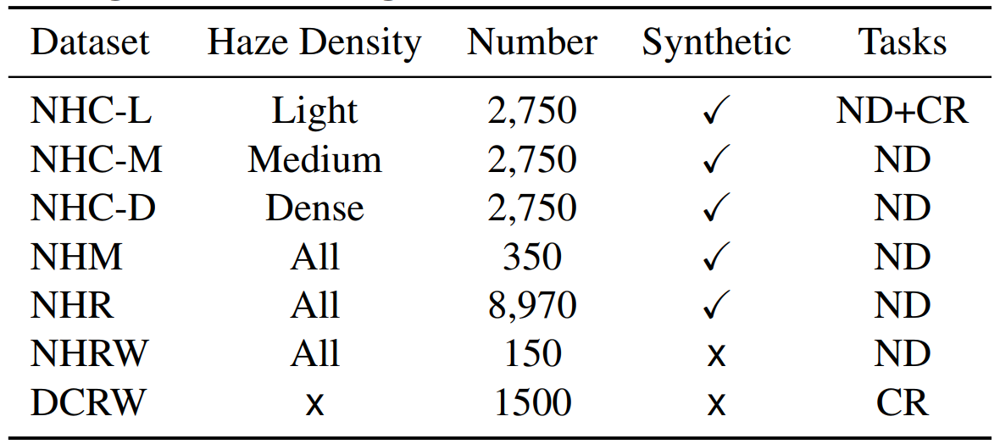
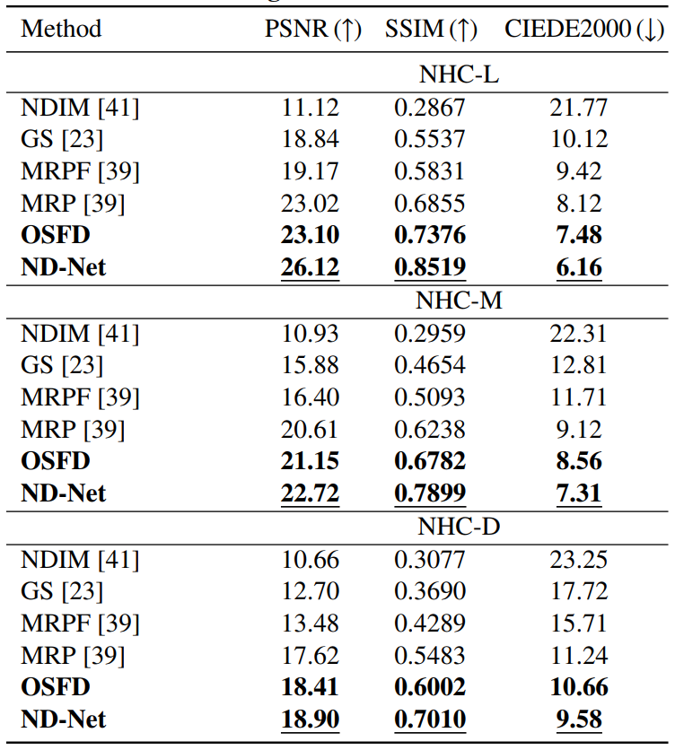
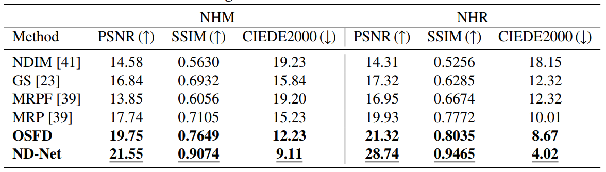
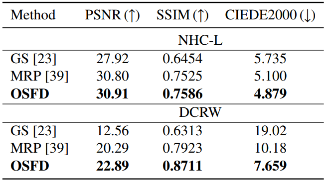
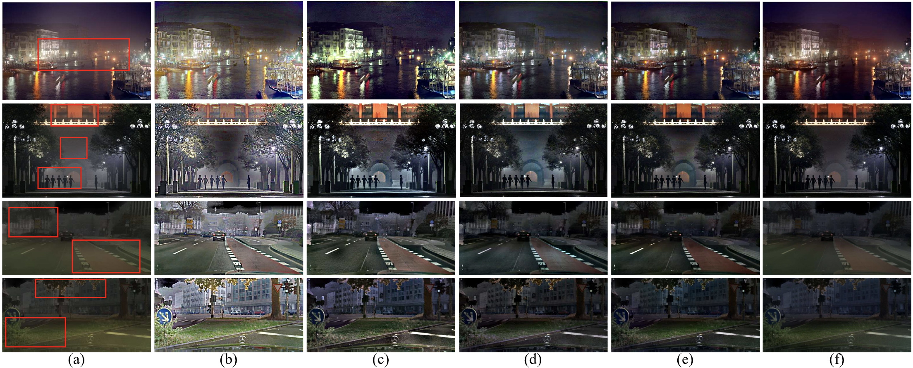
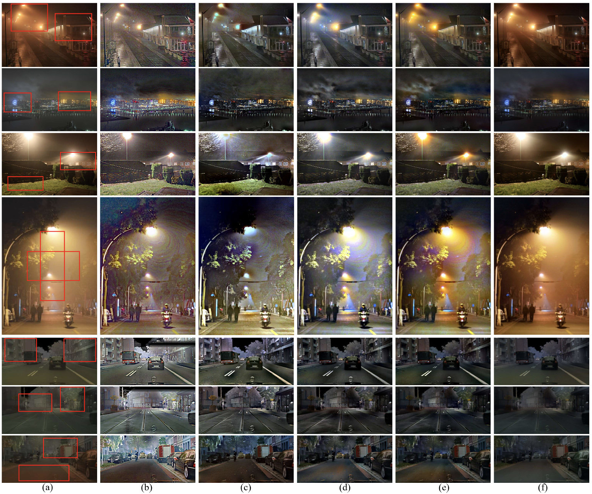

# Nighttime Dehazing with a Synthetic Benchmark
<!-- by
Author 1,
Author 2,
etc -->

***
>
><h3><strong><i>🚀 News</i></strong></h3>

> [2022-05-21]: Update the json files of train and val split of the NHR dataset at GoogleDrive and BaiduDisk ("/MM2020_3R_datasets/NHR/").
> 
> [2022-04-16]: Update the NHC (Cityscapes) dataset at [OneDrive](https://1drv.ms/u/s!AimBgYV7JjTle3TRc6fV7B_Cp1Y?e=qdaIUY).
> 
> [2021-07-07]: Update the OSFD code at 3R/code/OSFD/.
> 
> [2020-10-27]: The datasets can be downloaded from [GoogleDrive](https://drive.google.com/drive/folders/1Q7Ep19eX3yBMwF4kfKI2TGUfeG-gXHKR?usp=sharing) or [BaiduDisk](https://pan.baidu.com/s/1KzAfpUysUTqmuXyCJU81iw) (code: is11).

This repository contains the code, datasets, models, and test results in the paper <a href="https://doi.org/10.1145/3394171.3413763">Nighttime Dehazing with a Synthetic Benchmark</a> (<a href="https://arxiv.org/abs/2008.03864">Arxiv</a>). Increasing the visibility of nighttime hazy images is challenging because of uneven illumination from active artificial light sources and haze absorbing/scattering. The absence of large-scale benchmark datasets hampers progress in this area. To address this issue, we propose a novel synthetic method called <strong>3R</strong> to simulate nighttime hazy images from daytime clear images, which first reconstructs the scene geometry, then simulates the light rays and object reflectance, and finally renders the haze effects. Based on it, we generate realistic nighttime hazy images by sampling real-world light colors from a prior empirical distribution. Experiments on the synthetic benchmark show that the degrading factors jointly reduce the image quality. To address this issue, we propose an optimal-scale maximum reflectance prior (<strong>OS-MRP</strong>) to disentangle the color correction from haze removal and address them sequentially. Besides, we also devise a simple but effective learning-based baseline (<strong>ND-Net</strong>) which has an encoder-decoder structure based on the MobileNet-v2 backbone. Experiment results demonstrate their superiority over state-of-the-art methods in terms of both image quality and runtime

## 3R

Since there are no public large-scale nighttime hazy images, to address the challenging issue, we propose a novel synthetic method named 3R, which can generate realistic nighttime hazy images. First, we carry out an empirical study on real-world light colors and obtain an empirical equation between the green channel and blue channel of light colors, along with an empirical distribution of green channel values as shonw in Figure 2. Based on them, we can sample realistic light colors as shown in the top-left subfigure.

Figure 2: Empirical study on the real-world light colors.

Then, we propose the 3R method, it can simulate rays in the scene and render the nighttime hazy images based on the reconstructed scene geometry.

Algorithm 1: Synthesizing Images via 3R.

As can be seen from the walls, roads, and cars in Figure 3(c), the illuminance is more realistic than Figure 3(b), since 3R leverages the scene geometry and real-world light colors. The haze further reduces image contrast, especially in distant regions. It is noteworthy that we mask out the sky region due to its inaccurate depth values. 3R also generates some intermediate results such as L, $\eta$, t, which are worthy of further study, for example for learning disentangled representations.

Figure 3: Examples of synthetic images. (a) Daytime clear images from the Cityscapes dataset [11]. (b) Results using the method in [39]. (c) Results using the proposed 3R. (d)-(e) Some intermediate results using 3R, i.e., (d) a low-light image without/with color cast, daytime hazy image, (e) the illuminance intensity, color cast, and haze transmission.

## OS-MRP

In this paper, we introduce a novel prior named Optimal-Scale Maximum Reflectance Prior (<strong>OS-MRP</strong>). It extends MRP to the multi-scale case but is more effective. The <strong>optimal scale</strong> is defined as a sufficiently large scale but not necessary to be larger to obtain the highest maximum reflectance probability. As can be seen from Figure 4, due to the diverse content in the image, the optimal scales for different local patches are different. For a local patch with diverse colors, the optimal scale should be small. 

Figure 4. Illustration of the optimal scale. (a) A clear image. (b) The optimal scale map. Hot colors represent large scales. Please refer to Section 4.1.

Based on this definition, we have the OS-MRP prior that the maximum reflectance is always close to one within each local patch at its optimal scale.

Figure 5: (a)-(d) Histograms of DCP [15], MRP [39], the proposed OS-MRP, and the optimal scales in OS-MRP, respectively.

## Datasets

Following [29], 550 clear images were selected from Cityscapes [11] to synthesize nighttime hazy images using 3R. We synthesized 5 images for each of them by changing the light positions and colors, resulting in a total of 2,750 images, called ''Nighttime Hazy Cityscapes'' (NHC). We also altered the haze density by setting $\beta_t$ to 0.005, 0.01, and 0.02, resulting in different datasets denoted NHC-L, NHC-M, and NHC-D, where ''L'', ''M'', and ''D'' represent light haze, medium haze, and dense haze. Further, we also modified the method in [39] by changing the constant yellow light color with our randomly sampled real-world light colors described in Section 3.1 and synthesized images on the Middlebury (70 images) [30] and RESIDE (8,970 images) datasets [21]. Similar to NHC, we augmented the Middlebury dataset by 5 times, resulting in a total of 350 images. They are denoted NHM and NHR, respectively. The statistics of these datasets are summarized in Table 1 in Section 6.

Table 1: Statistics of the benchmark datasets. ND and CR refer to the nighttime dehazing task and color removal task.

The datasets can be downloaded from [GoogleDrive](https://drive.google.com/drive/folders/1Q7Ep19eX3yBMwF4kfKI2TGUfeG-gXHKR?usp=sharing) or [BaiduDisk](https://pan.baidu.com/s/1KzAfpUysUTqmuXyCJU81iw) (code: is11). NHC-L, NHC-M, nad NHC-D can be generated by the [3R code](./code/3R) in this repository or downloaded from [OneDrive](https://1drv.ms/u/s!AimBgYV7JjTle3TRc6fV7B_Cp1Y?e=qdaIUY).

## Results

Table 2: Dehazing results on the NHC dataset.

Table 3: Dehazing results on the NHM and NHR datasets.

Table 4: Dehazing results on the NHM and NHR datasets.

Figure 1: (a) Nighttime hazy images. (b) NDIM [41]. (c) GS [23]. (d) MRP [39]. (e) Our OSFD. (f) Our ND-Net.

Figure 6: (a) Nighttime hazy images. (b) NDIM [41]. (c) GS [23]. (d) MRP [39]. (e) Our OSFD. (f) Our ND-Net.

## Slides and Video

<a href="./video/MM2020_5min.pdf">Slides</a>,
<a href="./video/MM20-fp1939.mp4">Video</a> 

## Reference
Please cite our paper in your publications if it helps your research:

    @inproceedings{zhang2020nighttime,
        title={Nighttime Dehazing with a Synthetic Benchmark},
        author={Zhang, Jing and Cao, Yang and Zha, Zheng-Jun and Tao, Dacheng},
        booktitle={Proceedings of the 28th ACM International Conference on Multimedia},
        pages={2355--2363},
        year={2020}
}

## Contact
Please have all correspondence go to the first author (Jing Zhang: jing.zhang1ATsydney.edu.au).
